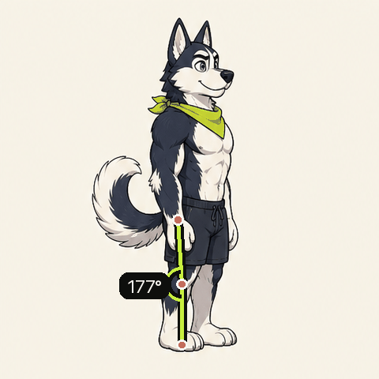
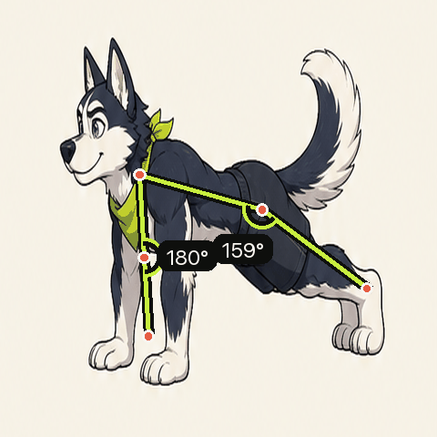
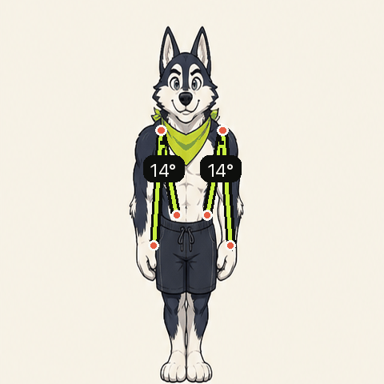
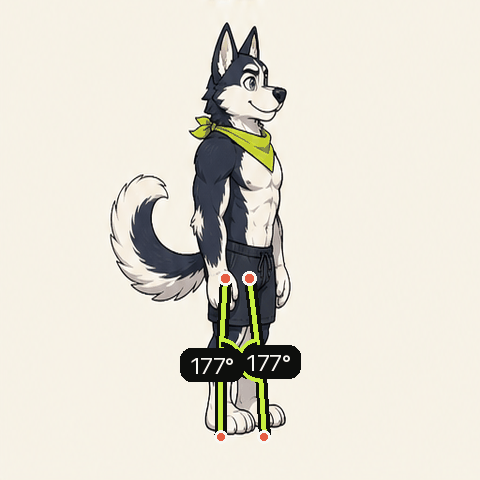

# Workout Detect

一个在设备本机识别健身动作并自动计数的项目，当前同时支持移动 Web 和微信小程序。两端共用动作定义、几何计算、训练记录规则和计数状态机，摄像头、姿态识别、画面绘制与录像则由各平台分别实现。

## 项目结构

```text
apps/
  admin/         React + Vite + SQLite 动作数据后台与骨骼编辑器
  web/           React + Vite + MediaPipe Web 应用
  miniprogram/   微信原生小程序 + VisionKit
packages/
  core/          与平台无关的动作计数核心
```

- Web 端继续使用 MediaPipe 的 33 个关键点，并通过 Web Worker 执行逐帧推理。
- 小程序使用微信 VisionKit 的 23 点人体识别结果，由适配层转换为计数核心需要的关键点布局。
- 小程序训练页会实时显示 Canvas 骨架，但录像直接来自 `CameraContext`，因此只包含原始相机画面，不包含骨架、计数 UI 或麦克风声音。
- Web 与小程序均提供“动作”一级导航，按胸部、背部、肩部、手臂、核心、臀部和腿部七大肌群筛选自重动作；动作详情复用同一份哈士奇演示数据。

## 动作演示

演示只标出动作中需要注意的关键点和角度。Web 和小程序共享同一份
`MotionProject` 多关键帧数据，按时间轴连续补间 33 个姿态点；Admin 中发布的
动作会生成到 `packages/core/src/generated/published-exercise-motions.ts`，未发布的
动作继续使用仓库内置版本。

<table>
  <tr>
    <th>深蹲</th>
    <th>俯卧撑</th>
  </tr>
  <tr>
    <td></td>
    <td></td>
  </tr>
  <tr>
    <th>开合跳</th>
    <th>弓步蹲</th>
  </tr>
  <tr>
    <td></td>
    <td></td>
  </tr>
</table>

## 本地开发

要求 Node.js `>=22.12.0`，包管理器使用 pnpm。Admin 使用 Node 内置 SQLite，因此仓库开发环境统一以 Node 22.12+ 为准。

```bash
pnpm install
pnpm dev
```

常用命令：

```bash
pnpm test        # 运行共享核心、Web 与 Admin 测试
pnpm build       # 构建 Web、Admin，并生成小程序使用的共享核心
pnpm admin:dev   # 启动动作编辑器
pnpm admin:build # 单独构建动作编辑器
pnpm motion:publish # 将 SQLite 中已发布动作生成到共享核心
pnpm mini:check  # 同步共享核心并检查小程序 TypeScript
pnpm preview     # 预览 Web 构建产物
```

Web 端详情见 [`apps/web/README.md`](apps/web/README.md)，动作编辑器见 [`apps/admin/README.md`](apps/admin/README.md)。

## 微信小程序

首次导入微信开发者工具前执行：

```bash
pnpm mini:prepare
```

然后在微信开发者工具中导入 `apps/miniprogram`。当前 [`project.config.json`](apps/miniprogram/project.config.json) 使用 `touristappid`，联调、真机预览和发布前需要替换为实际小程序 AppID。共享核心生成在 `apps/miniprogram/miniprogram/shared/core`，不要直接编辑该目录；修改 `packages/core/src` 后重新运行 `pnpm mini:prepare`。

小程序支持：

- 深蹲、俯卧撑、开合跳和弓步蹲实时计数
- 前置相机、VisionKit 本机人体识别和 Canvas 骨架提示
- 暂停、训练计时、振动反馈和目标完成页
- 原始相机录像本机保存、播放、导出到相册和删除
- 达到目标时保存录像；未达到目标时仅训练满 10 秒才保存

VisionKit、相机帧与原生录像能力需要在 iOS 和 Android 真机上分别验证。开发者工具可以检查页面和类型，但不能替代真机姿态识别、镜像方向、Canvas 覆盖层与录像并行能力测试。

更具体的导入和验收步骤见 [`apps/miniprogram/README.md`](apps/miniprogram/README.md)。

## 隐私与限制

两端均在当前设备内处理姿态，不会把相机帧上传到项目服务器。训练录像只保存在当前设备；用户清理站点/小程序数据或系统回收存储时可能丢失，需要长期保留时应主动导出。

单摄像头姿态估计会受弱光、运动模糊、遮挡、服装和拍摄角度影响。当前规则用于健身动作计数，不是医疗级测量，上线前仍需用目标机型和真实训练样本校准阈值。

## 许可证

原创源代码采用 [MIT License](LICENSE)。MediaPipe SDK、WASM、Pose Landmarker 模型和引用的 Google 示例仍遵循 Apache License 2.0，详见 [THIRD_PARTY_NOTICES.md](THIRD_PARTY_NOTICES.md)。
